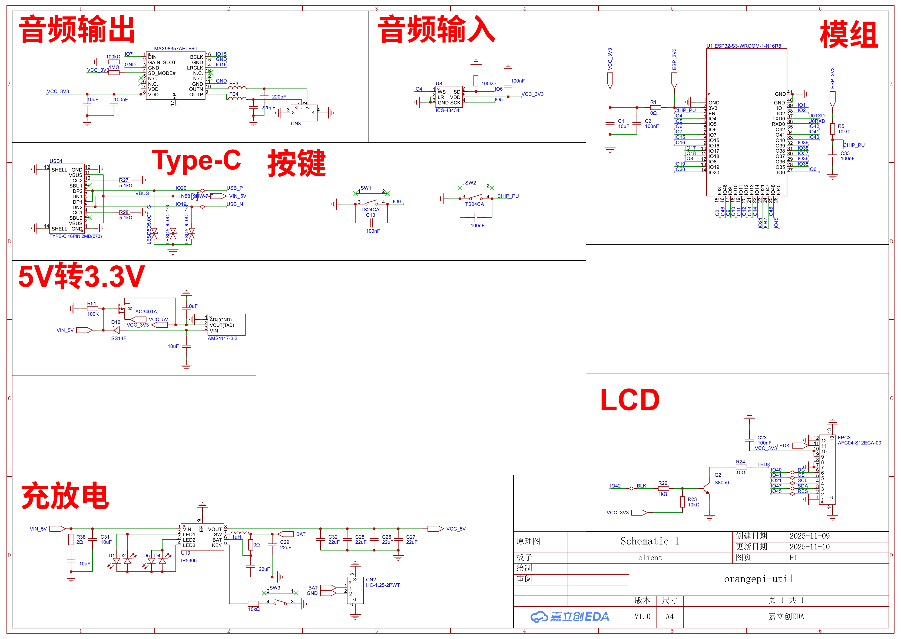
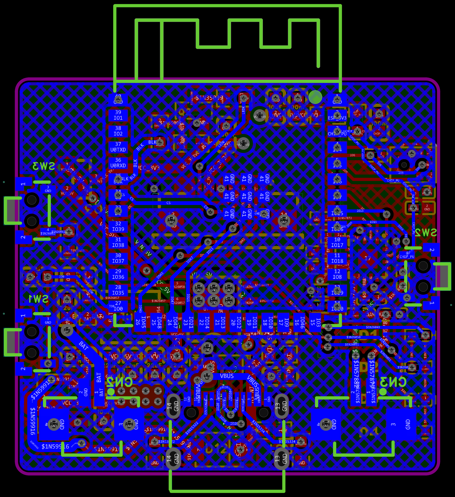
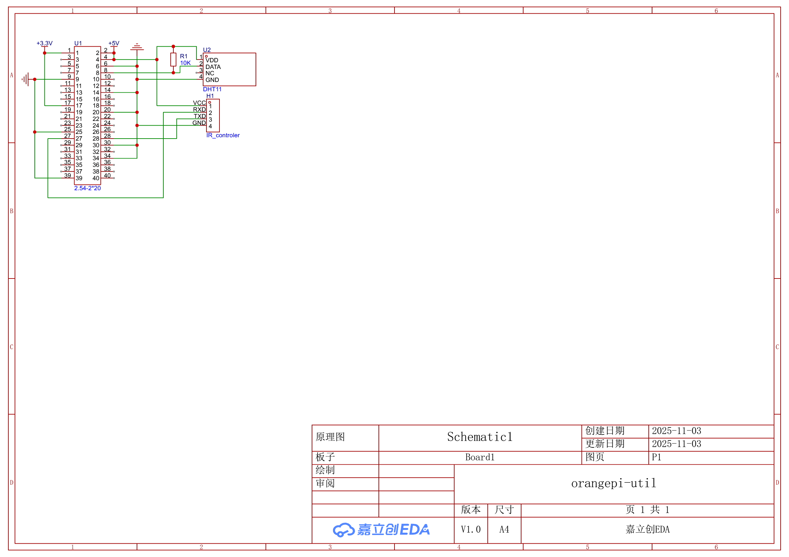
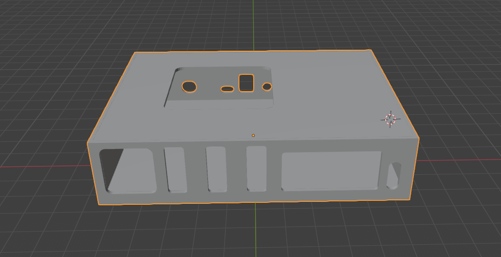

# OrangePi-Util

## Introduction

A voice assistant build for home which can control everything and know anything ! Because it is powered by AI and expansion by MCP! Other than that,  it can be used as a set-top box (similar to Apple TV). 

## Why I Made This Project
The main reason I created this project is that my home lacked a smart speaker. Furthermore, the smart speakers currently available on the market don't offer much in terms of customizability. Therefore, I built this project from scratch to serve as a highly customizable, AI-powered voice assistant tailored specifically for my family's needs.

## Features
- Voice assistant--you can use it directly or with a client
- Infrared device control
- MCP support
- Set-box
- AI integration
- Local speech recognition

## How to Use / Installation

To get started with this project, you need to configure both the hardware and the software services:

### ESP32 Client (Hardware Board)
1. Clone this repository and navigate to `voice_rec/esp32-client`.
2. Follow the instructions in its `README.md` to compile the code and flash it to your ESP32 board.
3. After flashing, restart the board. It will enter the network configuration mode. Connect to its hotspot to set up your Wi-Fi and server configuration.

### Sub-server (Required)
`xiaozhi-esp32-server` is the backend server that both the ESP32 and OrangePi clients need to function properly.
1. Navigate to `voice_rec/xiaozhi-esp32-server`.
2. Read its `README.md` for deployment options (you can choose between full-service deployment or single-module deployment).
3. Deploy it on your server and configure the clients to connect to this server address.

### OrangePi Python Client
`py-xiaozhi` is the client software that runs directly on your OrangePi.
1. Navigate to `voice_rec/py-xiaozhi`.
2. Follow its `README.md` to install the dependencies and run it via Python.

### Optional Modules
- **Voiceprint API (`voice_rec/voiceprint-api`)**: An optional service for voiceprint recognition. It helps Xiaozhi distinguish who is speaking and react differently based on the user. Deploy it if you want personalized responses!
- **Set-top Box (`tv_box`)**: The source code for the OrangePi set-top box software. It is built using Electron. Simply compile and install it to use the OrangePi as a smart TV box.

## Directory Structure
```
OrangePi-Util/
├── PCB/                  # PCB design files and images
├── CAD/                  # Model files
├── voice_rec/               # Voice recognition and assistant module
├──── mcp_assistant/                  # MCP assistant module
├──── py_xiaozhi/                            # python client
├──── voiceprint-api/                  # Voiceprint recognition API
├──── xiaozhi-esp32-server/      # Voice assistant server
├──── esp32-client/                  # ESP32 client
├── tv_box/                  # Set-top box module
├── server/                  # Server module
```

## Examples






## License
This project is using MIT License, you can look [here](LICENSE) for more information.

## BOM (Bill of Materials)

| Item | Description | Quantity | Unit Price | Total Price($) | URL | Running Total ($ with Tax) | Note |
|---|---|---|---|---|---|---|---|
| orangepi 5-puls | we need a strong computer to run the server with voice recognization | 1 | 888.88 | 125.19 | [Link](https://p.goofish.com/p/oAeRKZWi) | 125.19 | |
| Infrared module | for adding infrared control functionality | 1 | 16.4 | 2.31 | [Link](https://mobile.yangkeduo.com/goods2.html?ps=41mug4mxAw) | 127.50 | You need to log in to your account to view product details. |
| Wireless network card | network support | 1 | 50.1 | 7.06 | [Link](https://mobile.yangkeduo.com/goods1.html?ps=CUKzeDywfM) | 134.56 | |
| Speaker | Speaker | 1 | 4.8 | 0.68 | [Link](https://mobile.yangkeduo.com/goods1.html?ps=CJUCv6Jf1s) | 135.24 | |
| DHT11 | indoor temperature | 1 | 0 | 0 | | 135.24 | I have an old DHT11 |
| Fan | fan for orangepi | 1 | 0 | 0 | | 135.24 | I have an old fan |
| client PCB | PCB | 1 | 40 | 5.63 | | 140.87 | |
| client EC | see JLCBOM.xls for more information | 1 | 141.99 | 20.00 | | 160.87 | |
